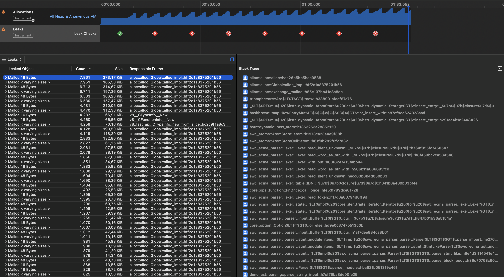

# Deno memory leak example

This repository contains a minimal example that shows that the Deno runtime leaks memory over time. We see the same behaviour in a server process that handles many FaaS calls.

Steps to reproduce:

Build, [sign](https://github.com/mlafeldt/dotfiles/blob/main/bin/codesign-for-instruments), and run the binary with the following command:

```
cargo build && codesign-for-instruments target/debug/deno-memleak && target/debug/deno-memleak
```

Open Instruments.app on macOS, select the "Leaks" template, attach it to the running deno-memleak process, and start recording (Cmd+R).

The result will look like this:



The heaviest frame:

```
alloc::alloc::alloc::hae26b5bb5bae9538
alloc::alloc::Global::alloc_impl::hff2c1a8375201b56
alloc::alloc::exchange_malloc::h85e137bb41c8a8dc
triomphe::arc::Arc$LT$T$GT$::new::h338901afacf67a76
_$LT$$RF$mut$u20$hstr..dynamic..AtomStore$u20$as$u20$hstr..dynamic..Storage$GT$::insert_entry::_$u7b$$u7b$closure$u7d$$u7d$::h9de3e79c5c8f8463
hashbrown::map::RawEntryMut$LT$K$C$V$C$S$C$A$GT$::or_insert_with::h87cf8ec624328aad
_$LT$$RF$mut$u20$hstr..dynamic..AtomStore$u20$as$u20$hstr..dynamic..Storage$GT$::insert_entry::h291ae4b1c2408426
hstr::dynamic::new_atom::h1353253a28852120
swc_atoms::AtomStore::atom::h1973ca23a4e9f38b
swc_atoms::AtomStoreCell::atom::h61f0b282f6f27d32
swc_ecma_parser::lexer::Lexer::read_ident_unknown::_$u7b$$u7b$closure$u7d$$u7d$::h764f055fc7450547
swc_ecma_parser::lexer::Lexer::read_word_as_str_with::_$u7b$$u7b$closure$u7d$$u7d$::h8f459bc2ca584540
swc_ecma_parser::lexer::Lexer::with_buf::h63f82e7413fabb44
swc_ecma_parser::lexer::Lexer::read_word_as_str_with::h506b11a686693fcd
swc_ecma_parser::lexer::Lexer::read_ident_unknown::hecc63b8b4d050b33
swc_ecma_parser::lexer::table::IDN::_$u7b$$u7b$closure$u7d$$u7d$::h341b8a489b33bf4e
core::ops::function::FnOnce::call_once::hfe53f789dce81728
swc_ecma_parser::lexer::Lexer::read_token::h17d6a83794d8ff9d
swc_ecma_parser::lexer::state::_$LT$impl$u20$core..iter..traits..iterator..Iterator$u20$for$u20$swc_ecma_parser..lexer..Lexer$GT$::next::_$u7b$$u7b$closure$u7d$$u7d$::h6952ca77d6b64fca
swc_ecma_parser::lexer::state::_$LT$impl$u20$core..iter..traits..iterator..Iterator$u20$for$u20$swc_ecma_parser..lexer..Lexer$GT$::next::h0e2f5af85aad5d44
swc_ecma_parser::parser::input::Buffer$LT$I$GT$::cur::_$u7b$$u7b$closure$u7d$$u7d$::h847b01b36a5154a1
core::option::Option$LT$T$GT$::or_else::hd9e0c3747b51350b
swc_ecma_parser::parser::input::Buffer$LT$I$GT$::cur::h1a17dee884ca8b61
swc_ecma_parser::parser::stmt::module_item::_$LT$impl$u20$swc_ecma_parser..parser..Parser$LT$I$GT$$GT$::parse_import::he276d6cd021a03cb
swc_ecma_parser::parser::stmt::module_item::_$LT$impl$u20$swc_ecma_parser..parser..stmt..StmtLikeParser$LT$swc_ecma_ast..module..ModuleItem$GT$$u20$for$u20$swc_ecma_parser..parser..Parser$LT$I$GT$$GT$::handle_import_export::h3c025e908fc9a300
swc_ecma_parser::parser::stmt::_$LT$impl$u20$swc_ecma_parser..parser..Parser$LT$I$GT$$GT$::parse_stmt_like::h9e4d3ff14541e48b
swc_ecma_parser::parser::stmt::_$LT$impl$u20$swc_ecma_parser..parser..Parser$LT$I$GT$$GT$::parse_block_body::h89d70763c608b7a0
swc_ecma_parser::parser::Parser$LT$I$GT$::parse_module::hba621b051319c46f
deno_ast::parsing::parse_string_input::h7cf76ba8de00fe25
deno_ast::parsing::parse::h09bff5cf733ae2f3
deno_ast::parsing::parse_module::hfb9bd0ee6c907943
deno_runtime::shared::maybe_transpile_source::h67a174a5d12c5f47
deno_runtime::worker::MainWorker::from_options::_$u7b$$u7b$closure$u7d$$u7d$::h356a4333b4425bb0
deno_core::extension_set::load::h6522cdf29b446c2c
deno_core::extension_set::into_sources::h1ed3cecd35dc7d68
deno_core::runtime::jsruntime::JsRuntime::new_inner::h66e6169c7eaaab1a
deno_core::runtime::jsruntime::JsRuntime::try_new::h337a125a3d6729de
deno_core::runtime::jsruntime::JsRuntime::new::h3e85cec2565db250
deno_runtime::worker::MainWorker::from_options::h860f5df1e23d56cf
deno_runtime::worker::MainWorker::bootstrap_from_options::ha8daa03837f22894
deno_memleak::run_js::_$u7b$$u7b$closure$u7d$$u7d$::h89b5f45c8725963f
deno_memleak::main::_$u7b$$u7b$closure$u7d$$u7d$::h4a3ba108d9f6439e
tokio::runtime::park::CachedParkThread::block_on::_$u7b$$u7b$closure$u7d$$u7d$::hec938dc69a42cbc4
tokio::runtime::coop::with_budget::h13389ff7c27cf582
tokio::runtime::coop::budget::h359004bd851241eb
tokio::runtime::park::CachedParkThread::block_on::h5c04918be408fa6d
tokio::runtime::context::blocking::BlockingRegionGuard::block_on::hd86475330142e780
tokio::runtime::scheduler::multi_thread::MultiThread::block_on::_$u7b$$u7b$closure$u7d$$u7d$::h74af0b85c4eae88c
tokio::runtime::context::runtime::enter_runtime::h09c39892bbaa7439
tokio::runtime::scheduler::multi_thread::MultiThread::block_on::h25967341f88797fc
tokio::runtime::runtime::Runtime::block_on::ha20e3c52c0d2b50e
deno_memleak::main::heb77b6c489869d48
core::ops::function::FnOnce::call_once::h9a34068cb06d4210
std::sys_common::backtrace::__rust_begin_short_backtrace::hce9d2ba2fa410ca9
std::rt::lang_start::_$u7b$$u7b$closure$u7d$$u7d$::h56e025a67c5ed253
std::rt::lang_start_internal::hecc68fef83c8f44d
std::rt::lang_start::heecb2d90a5facc89
main
start
```
